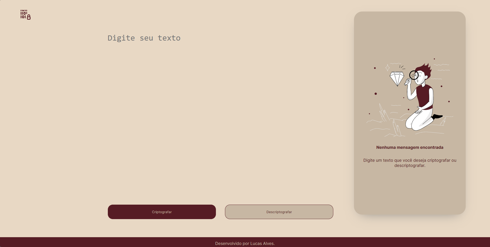

# Projeto Criptografador

> 🧗‍♂️ Projeto Criptografador 

Projeto construído a partir de um desafio lançado para os alunos do project ONE em uma parceria entre a Oracle e Alura.

🔗[Clique aqui para acessar.](https://lucasaalv.github.io/Encryptor/)

## 💻 - Tecnologias que utilizei:

- HTML
- CSS
- Javascript
- Git e Github
- Figma

## 🤓 O que aprendi:

- Fundamentos de programação com JS.
- Estruturação dos arquivos HTML e CSS.
- Criação de repositorios, commits, pull request, entre outras manipulações do git e github.

## 📩 Meu contato:

- alveslucasw@gmail.com